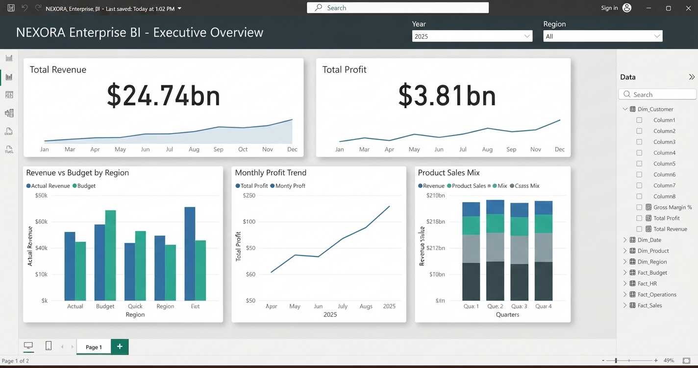

# EduVision_Portfolio_Project
# 🚀 NEXORA Enterprise BI | CEO Executive Dashboard

An enterprise-grade Business Intelligence solution built to empower executive leadership with real-time financial tracking, profitability analysis, and predictive business insights.

---

## 📊 Project Overview
NEXORA Enterprise BI is an end-to-end data analytics and visualization project designed to transform raw enterprise data into actionable executive insights.

---

## 🖼️ Dashboard Preview

---

## ⚙️ Core DAX Measures
```dax
Total Revenue = SUM(Fact_Sales[Revenue])
Total Profit = SUM(Fact_Sales[Profit])
Gross Margin % = DIVIDE([Total Profit], [Total Revenue], 0)
